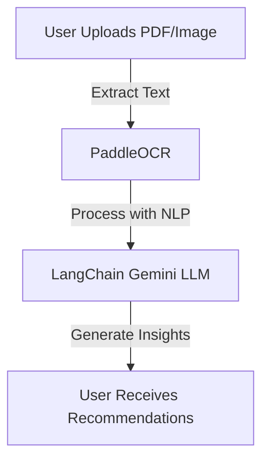
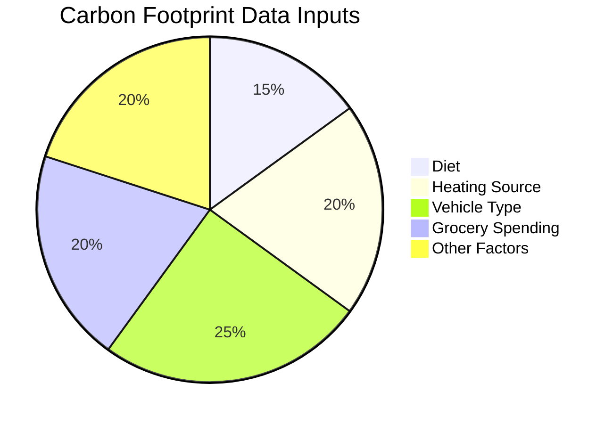
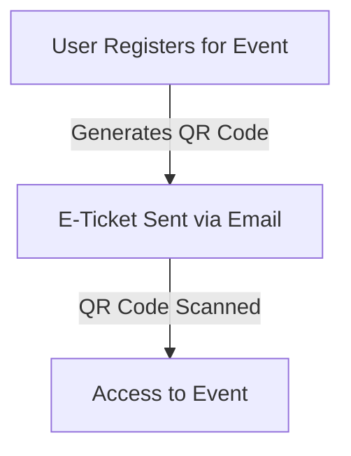
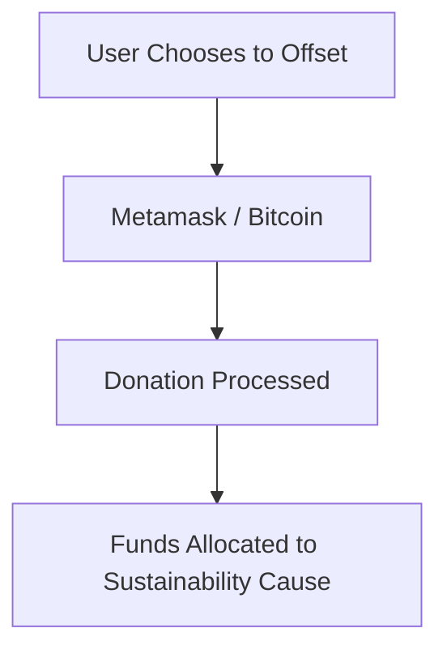
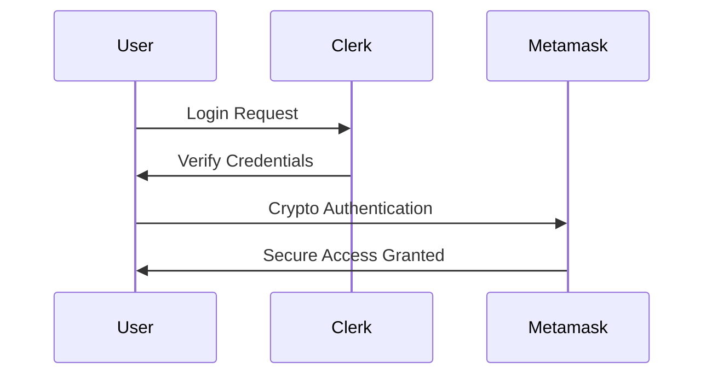
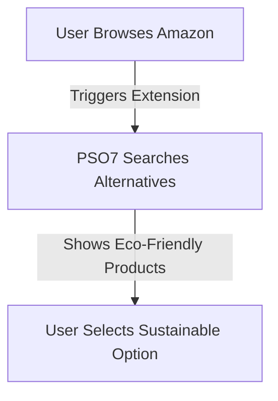
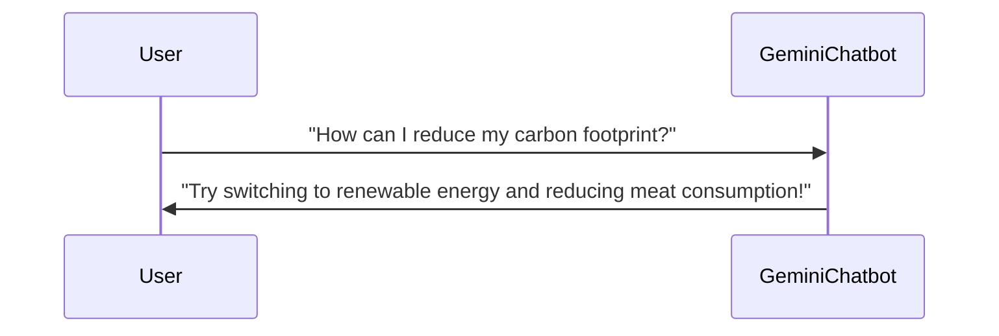

# 🌱 PSO7: Your Sustainability Companion

## 🏆 **Technovate Hackathon 5th Position**
## 🌍 Introduction
**PSO7** isn't just an app; it's a **community-driven platform** dedicated to raising awareness and inspiring action against climate change. With a **360-degree approach**, we integrate personal tracking, reward systems, user events, and sustainable shopping tools to make **eco-friendly choices accessible, engaging, and impactful.**

---

## 🏗️ Workflow and Priority Breakdown

### 📌 1. Core Functionality: OCR and Audio Analysis

#### 📝 OCR Integration
✅ **Technology Used:** PaddleOCR, LangChain-powered Gemini LLM  
✅ **Functionality:** Extracts and interprets **text from PDFs and images** to provide actionable insights  
✅ **Use Case:** Users uploading **carbon-related data** get **tailored recommendations**  

#### 🔊 Audio Processing
✅ **Technology Used:** OpenAI Whisper  
✅ **Functionality:** Breaks down **English audio files into 30-second chunks** for efficient processing  
✅ **Use Case:** Summarizes and analyzes **spoken advice or meeting discussions** on sustainability practices  

---

### 🌿 2. Enhanced User Tracking: Carbon Footprint Calculator

#### 🔢 Carbon Footprint Calculation Parameters
✅ **Input Factors:** Diet, Heating Source, Vehicle Type, Grocery Spending, and more  
✅ **Analysis:** Calculates the **carbon footprint based on lifestyle choices**  

#### 🏆 Algorithm Selection
✅ **Tested Models:** Random Forest, XGBoost, LightGBM, SVM, Decision Tree  
✅ **Best Model:** **Random Forest** (due to high-dimensional data handling)  

---

### 🚗 3. User Engagement Features: Carpool Map and Green Shopping

#### 🗺️ Carpooling Map
✅ **Displays Nearby Users** in Green, Further Users in Red  
✅ **Eases Coordination** for eco-friendly travel  

#### 🛍️ Green Product Recommendations
✅ **Technology Used:** LangChain-powered Semantic Search, RAG, ChromaDB, FAISS  
✅ **Functionality:** Scrapes Amazon data to **redirect users to eco-friendly alternatives**  

---

### 🏅 4. Incentives and Social Engagement: Leaderboard & Events

#### 📊 Leaderboard and Rewards System
✅ **Features:** Ranks users based on their **carbon footprint reduction**  
✅ **Gamification:** Top users **earn medals**, and upcoming **competitions** offer redeemable points  

#### 🎟️ Secure Event Registration
✅ **E-Ticketing:** Secure QR-code-based event passes  
✅ **Encourages participation** in **sustainability activities**  

---

### 💰 5. Financial Impact: Carbon Offsetting & Donations

#### 🔗 Metamask Integration for Offsetting
✅ **Supports Donations:** Users can contribute via **Metamask & Bitcoin**  
✅ **Direct Impact:** Funds sustainability causes  

---

### 🔐 6. Security and User Access

#### 🛡️ Login & Data Security
✅ **Implemented:** **Clerk Login & Metamask Authentication**  
✅ **Security Measures:** Email validation, field encryption  

---

## 🌟 Extension Features

### 🛒 **Seamless Green Shopping with Browser Extension**
✅ **Works with:** Amazon & other e-commerce sites  
✅ **Redirection:** Suggests eco-friendly alternatives in real-time  

### 🤖 **Gemini-Powered Chatbot for Eco Advice**
✅ **Trained for:** **Carbon footprint reduction queries**  
✅ **Assists with:** Energy-saving tips, green transport suggestions, sustainability reports  

---

## 📢 **Conclusion**
PSO7 is a comprehensive platform designed to **empower users to take climate-conscious actions.** With a strong focus on **personal tracking, incentives, and AI-driven insights**, PSO7 makes sustainable living easy, engaging, and rewarding. **Together, we can drive impactful change!** 🌎💚

📝 **License:** MIT  
🤝 **Contributions:** Open to pull requests!

---
